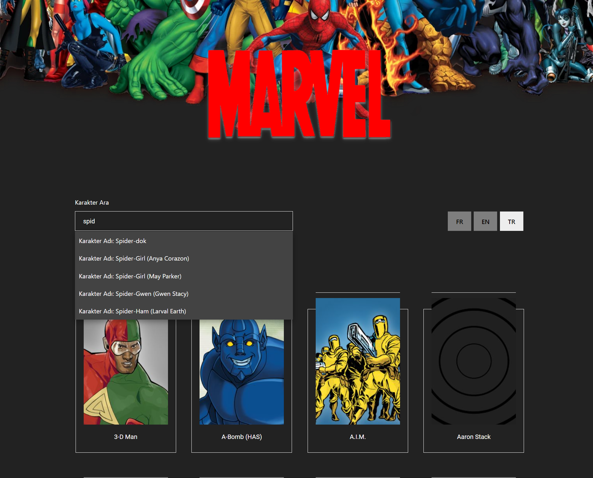
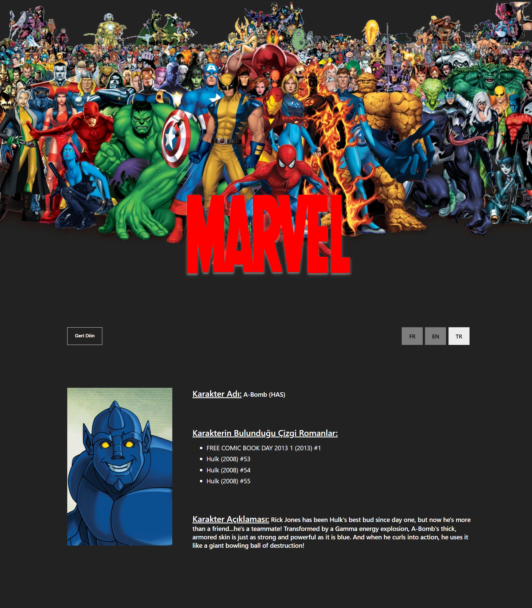

# Week 6 Assignment
You can find the live version of the application [here](https://react-bootcamp-week5-assignment.vercel.app/).

In this assignment made with React, a project that displayed characters on the screen was previously carried out using the Marvel API. Now it has been improved with a few additions to it. Added a structure that enables character search and 3 language options. In addition, a detail page has been added where the information about that character is displayed when the characters are clicked.

## Search Bar

## Detail Page

## Home Page

